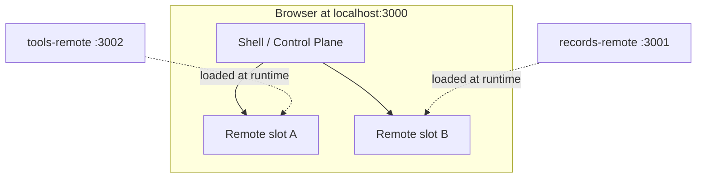
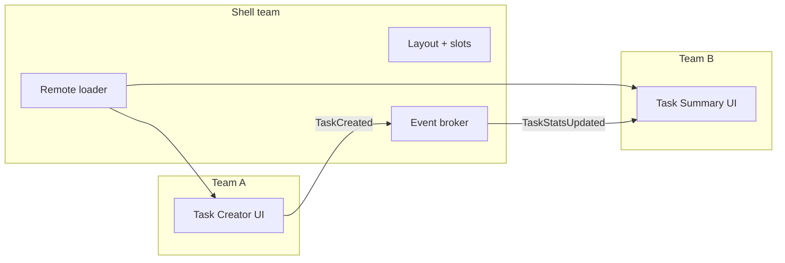
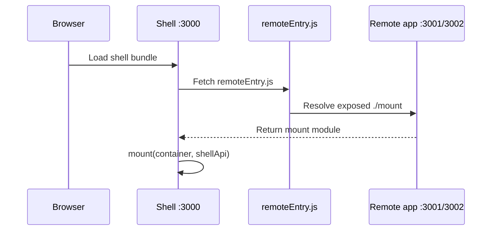
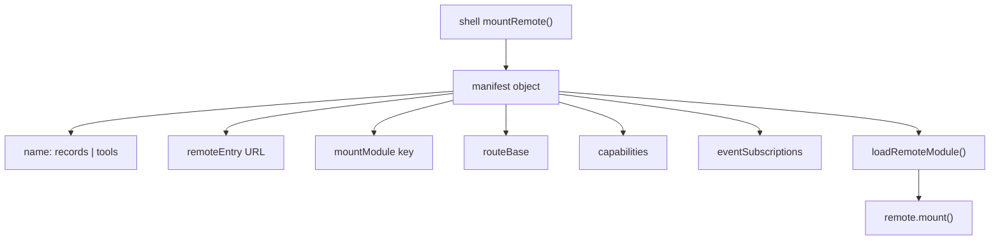
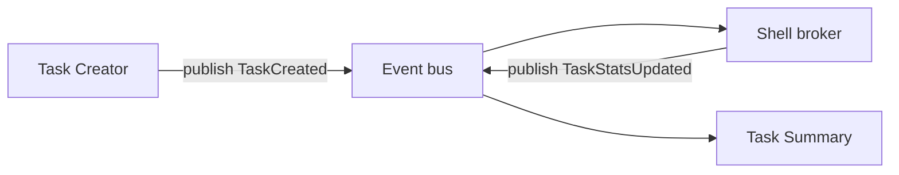
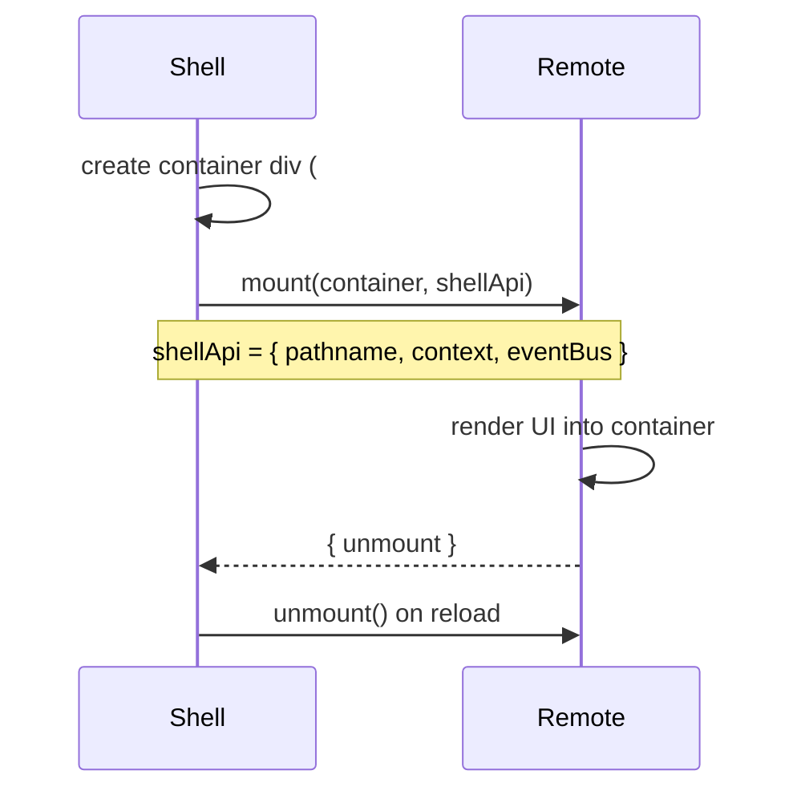
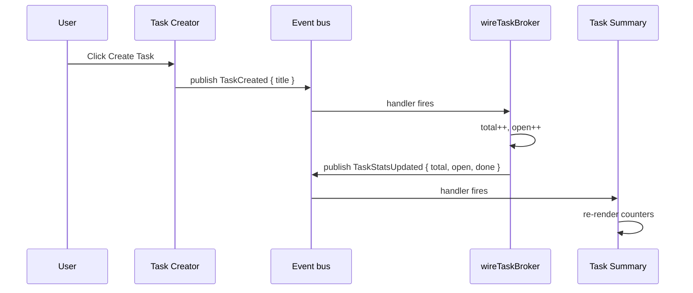
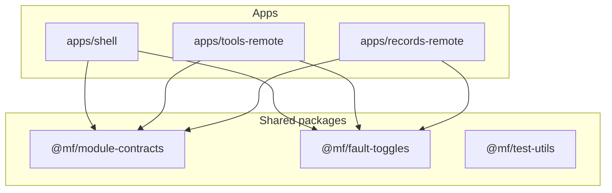
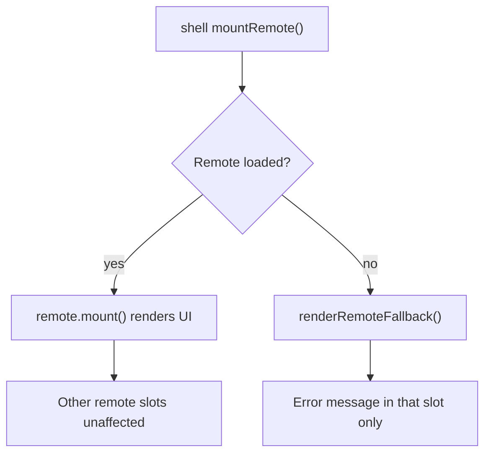
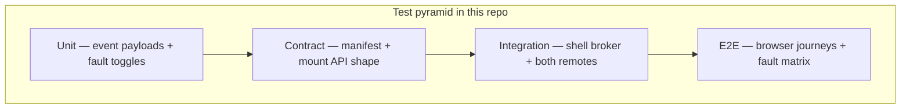

# MF Fundamentals Walkthrough

Read this before the exercises. Each part explains one concept, shows where it lives in this repo, and gives you something concrete to look at.

Suggested pace: one part per session (~10–15 min each).

---

## Part 1 — What is a micro-frontend?

A **micro-frontend (MF)** splits one product UI into pieces that different teams can own and ship independently.

In this repo you have three apps:

| App | Folder | Port | Role |
|---|---|---|---|
| Shell (host) | `apps/shell` | 3000 | Loads remotes, renders layout, coordinates events |
| Task Creator (remote A) | `apps/tools-remote` | 3002 | Form to create a task |
| Task Summary (remote B) | `apps/records-remote` | 3001 | Displays task counters |



**Key idea:** the shell owns the page frame. Remotes own their UI inside assigned slots.

**Look in browser:** open [http://127.0.0.1:3000/](http://127.0.0.1:3000/) and find the topology panel on the left.

**Files to skim:**
- `apps/shell/src/shellApp.ts` — shell layout and remote mounting
- `apps/shell/src/styles.css` — colored boundaries around host vs remotes

---

## Part 2 — Host vs remote responsibilities

Each role has a job:

| Role | Owns | Example in this repo |
|---|---|---|
| **Host (shell)** | Page chrome, remote slots, loading remotes, brokering cross-remote events | header, topology panel, `wireTaskBroker` |
| **Remote** | Its own UI and local behavior inside a slot | task form, summary counters |



**Key idea:** remotes talk to the shell through a shared API (`shellApi`). Cross-remote updates go through the shell broker.

**Files to read:**
- `apps/shell/src/shellApp.ts` — `bootstrapShell`, `mountRemote`, `wireTaskBroker`
- `apps/tools-remote/src/mount.ts` — remote A
- `apps/records-remote/src/mount.ts` — remote B

**Checkpoint:** can you name one thing the shell does for both remotes?

---

## Part 3 — Module Federation: loading code at runtime

This repo uses **Webpack Module Federation** so the shell can import remote code from other dev servers while the app is running.

Three moving parts:

1. **Remote exposes** a module (its `mount` function)
2. **Shell declares remotes** it can consume
3. **Browser fetches** `remoteEntry.js` and loads the exposed module



**Remote exposes** (`apps/tools-remote/webpack.config.ts`):

```ts
exposes: {
  "./mount": path.resolve(__dirname, "src/mount.ts"),
}
```

**Shell consumes** (`apps/shell/webpack.config.ts`):

```ts
remotes: {
  recordsRemote: "recordsRemote@http://127.0.0.1:3001/remoteEntry.js",
  toolsRemote: "toolsRemote@http://127.0.0.1:3002/remoteEntry.js",
}
```

**Shell imports at runtime** (`apps/shell/src/shellApp.ts`):

```ts
"tools/mount": () => import("toolsRemote/mount"),
"records/mount": () => import("recordsRemote/mount"),
```

**Key idea:** remotes are separate builds on separate ports. The shell stitches them together in the browser.

**Try it:** with `npm run dev` running, open [http://127.0.0.1:3002/remoteEntry.js](http://127.0.0.1:3002/remoteEntry.js) in the browser — that file is the federation entry point.

**Files to read:**
- `apps/shell/webpack.config.ts`
- `apps/tools-remote/webpack.config.ts`
- `apps/records-remote/webpack.config.ts`

---

## Part 4 — Manifests: how the shell knows about remotes

A **manifest** is metadata the shell uses to load and wire a remote. Think of it as a registration card.



**File:** `apps/shell/src/manifests.ts`

Example entry:

```ts
{
  name: "tools",
  remoteEntry: "http://127.0.0.1:3002/remoteEntry.js",
  routeBase: "/task-creator",
  mountModule: "tools/mount",
  capabilities: ["tasks.create"],
  eventSubscriptions: [],
}
```

| Field | Meaning |
|---|---|
| `name` | Remote identifier used by shell |
| `remoteEntry` | Where federation entry lives |
| `mountModule` | Which exposed module to import |
| `routeBase` | Path context passed into remote |
| `capabilities` | What this remote can do (contract metadata) |
| `eventSubscriptions` | Events this remote cares about |

Validation lives in `packages/module-contracts/src/index.ts` → `validateRemoteManifest()`.

**Key idea:** adding a remote to the shell starts with a manifest entry, not with UI code in the shell.

**Checkpoint:** open `manifests.ts` and match each field to something you see in the browser.

---

## Part 5 — Contracts: the shared language between teams

Remotes and shell communicate through **typed events** defined in a shared package.

**File:** `packages/module-contracts/src/index.ts`

Events in this repo:

| Event | Publisher | Payload | Consumer |
|---|---|---|---|
| `TaskCreated` | Task Creator remote | `{ title: string }` | Shell broker |
| `TaskStatsUpdated` | Shell broker | `{ total, open, done }` | Task Summary remote |



The **event bus** validates payloads before delivery:

```ts
// packages/module-contracts/src/index.ts
eventBus.publish(EVENT_TYPES.TASK_CREATED, { title: "Plan sprint" }, "task-creator-remote");
```

If the payload is invalid, `publish` throws — bad data stops at the boundary.

**Key idea:** `@mf/module-contracts` is the shared API package. Both shell and remotes import it.

**Files to read:**
- `packages/module-contracts/src/index.ts` — `EVENT_TYPES`, `validateEventPayload`, `createEventBus`
- `apps/tools-remote/src/mount.ts` — publishes `TaskCreated`
- `apps/records-remote/src/mount.ts` — subscribes to `TaskStatsUpdated`

**Try it:** create a task in the browser and watch the shell telemetry line update (`TaskStatsUpdated:shell`).

---

## Part 6 — The mount API: how a remote plugs into the shell

Every remote exposes the same entry shape:

```ts
mount(container: HTMLElement, shellApi: object) => { unmount?: () => void }
```



**What the shell passes in (`shellApi`):**

| Property | Purpose |
|---|---|
| `pathname` | Route context from manifest (`/task-creator`, `/task-summary`) |
| `context` | Shared shell context (user, workspace, permissions, taskStats) |
| `eventBus` | Publish/subscribe for typed events |

**Task Creator** (`apps/tools-remote/src/mount.ts`):
- reads `context.workspace` to enable/disable the form
- publishes `TaskCreated` on button click

**Task Summary** (`apps/records-remote/src/mount.ts`):
- reads initial `context.taskStats`
- subscribes to `TaskStatsUpdated` and re-renders counters

**Key idea:** `mount` is the remote's only front door. Same signature for every remote.

**Checkpoint:** find where each remote returns `{ unmount }` and what cleanup it does.

---

## Part 7 — Shell broker: translating intent across remotes

When you click **Create Task**, this happens:



**File:** `apps/shell/src/shellApp.ts` → `wireTaskBroker()`

```ts
eventBus.subscribe(EVENT_TYPES.TASK_CREATED, () => {
  const next = { total: current.total + 1, open: current.open + 1, done: current.done };
  writeStats(next);
  eventBus.publish(EVENT_TYPES.TASK_STATS_UPDATED, { ...next }, "shell");
});
```

**Key idea:** the shell owns the translation rule. Remotes emit intent; the shell decides how that intent affects shared state.

**Why this matters:** if the summary rules change (e.g. count `done` instead of `open`), you change the broker — remotes stay the same.

---

## Part 8 — Shared packages: what everyone imports

This repo is a monorepo with workspace packages:



| Package | Role |
|---|---|
| `@mf/module-contracts` | Event types, payload validation, event bus, manifest validation |
| `@mf/fault-toggles` | Deterministic fault injection for resilience demos/tests |
| `@mf/test-utils` | Helpers used in test files |

Webpack marks contracts and fault-toggles as **shared singletons** so all apps use one instance:

```ts
// apps/shell/webpack.config.ts
shared: {
  "@mf/module-contracts": { singleton: true, eager: true },
  "@mf/fault-toggles": { singleton: true, eager: true },
}
```

**Key idea:** shared packages hold cross-team agreements. App-specific logic stays in each app folder.

---

## Part 9 — Fault isolation: one remote fails, shell keeps running

The shell wraps remote loading in try/catch. If a remote fails, only its slot shows an error.



Faults are injected through `@mf/fault-toggles`:

```js
// Browser console
window.__MF_FAULTS__.setFault("tools", { manifestUnavailable: true });
// then click "Reload remotes"
```

Available faults: `manifestUnavailable`, `backendTimeout`, `backendError`, `latencyMs`.

**Files to read:**
- `packages/fault-toggles/src/index.ts`
- `apps/shell/src/shellApp.ts` — `renderRemoteFallback`
- `apps/tools-remote/src/mount.ts` — `runWithBackendFault("tools", ...)`
- `apps/records-remote/src/mount.ts` — `runWithBackendFault("records", ...)`

**Key idea:** failures are scoped to the remote boundary. The shell frame and other remotes stay up.

---

## Part 10 — How testing maps to the architecture

Tests mirror the same boundaries you just learned:



| Layer | Folder | What it proves |
|---|---|---|
| Unit | `tests/unit/` | Event payload rules, fault toggle behavior |
| Contract | `tests/contract/` | Manifests valid, remotes expose `mount` |
| Integration | `tests/integration/` | Task creation flows through real `wireTaskBroker` |
| E2E | `tests/e2e/` | Full browser flow + resilience scenarios |

**Key idea:** each layer tests one ring of the architecture. Start from the inside (contracts) and move outward.

More detail: [`Testing strategy`](../README.md#testing-strategy)

---

## Part 11 — Repo map (quick reference)

```
mf-shell-testing-example/
├── apps/
│   ├── shell/              ← Host: layout, broker, remote loader
│   ├── tools-remote/       ← Remote A: Task Creator
│   └── records-remote/     ← Remote B: Task Summary
├── packages/
│   ├── module-contracts/   ← Shared events + validation
│   ├── fault-toggles/      ← Fault injection for resilience
│   └── test-utils/         ← Test helpers
├── tests/
│   ├── unit/
│   ├── contract/
│   ├── integration/
│   └── e2e/
└── docs/                   ← You are here
```

**Run commands:**

```bash
npm run dev          # start shell + both remotes
npm test             # unit + contract + integration + smoke E2E
npm run test:e2e     # full resilience matrix
```

---

## What to do next

Once Parts 1–10 make sense:

1. **[Contract-first curriculum](./contract-first-curriculum.md)** — build-order exercises
2. **[Workshop labs](./workshop-labs.md)** — break/fix checkpoints
3. Re-read [`Testing strategy`](../README.md#testing-strategy) with the architecture in mind

**Final checkpoint:** explain this flow without opening files:

> User creates task → Creator publishes `TaskCreated` → shell broker updates stats → shell publishes `TaskStatsUpdated` → Summary re-renders

If you can say that confidently, you are ready for the hands-on exercises.
